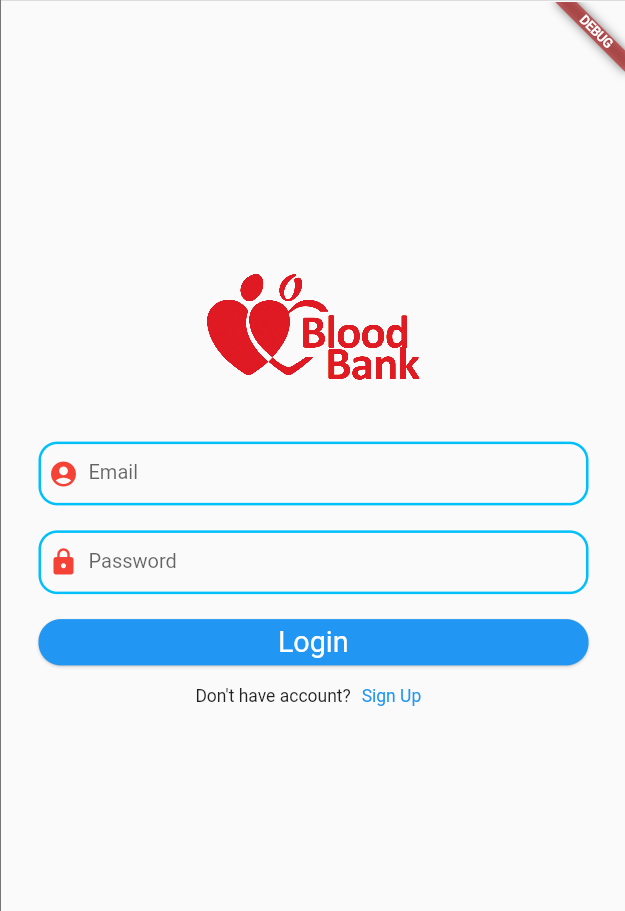
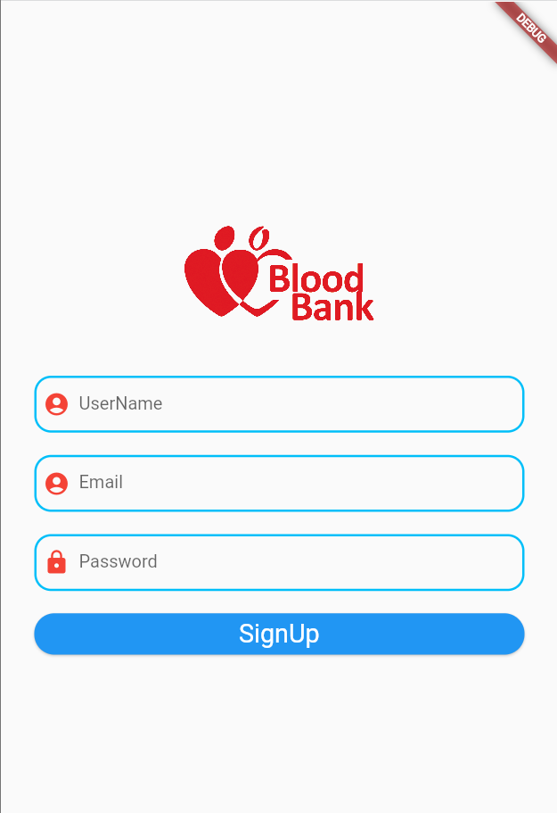
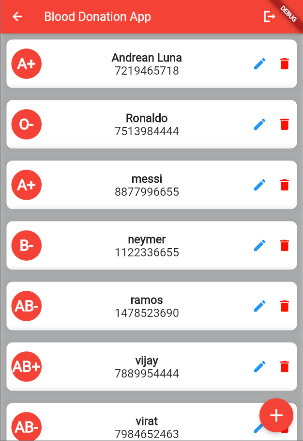
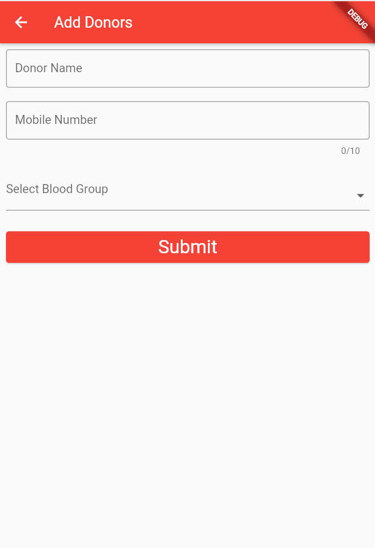
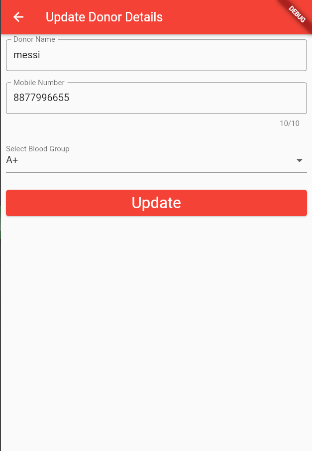

# Blood Bank App

## Overview
The Blood Bank App is a mobile application developed using Flutter that facilitates the management of blood donation and transfusion services. The app allows users to perform CRUD (Create, Read, Update, Delete) operations related to donors, recipients, and blood inventories, ensuring an efficient and seamless process for managing blood bank services.

## Features

### User Registration and Authentication
- **Register and Log In:** Users can register and log in to access the app's features securely.

### Donor Management
- **Add Donors:** Register new blood donors with their personal details and blood type.
- **View Donors:** Browse and search through the list of registered donors.
- **Update Donor Information:** Edit donor details when necessary.
- **Delete Donors:** Remove donor records from the database.

### Recipient Management
- **Add Recipients:** Register new recipients with their personal details and blood requirements.
- **View Recipients:** Browse and search through the list of registered recipients.
- **Update Recipient Information:** Edit recipient details when necessary.
- **Delete Recipients:** Remove recipient records from the database.

### Screenshots
<div style="display: flex; flex-wrap: wrap; justify-content: center;">
  
  
  
  
  
  
  
  
</div>


# CRUD Operation Using Firebase

# Firebase Configuration with help of FlutterFire CLI

## Setup
### Install Firebase CLI

 The Firebase CLI can be installed using various methods depending on your platform. For detailed instructions, please refer to the following link: https://firebase.google.com/docs/cli.

If you are using npm, you can install the Firebase CLI globally by running the following command: 
```bash
npm install -g firebase-tool
```

### Install FlutterFire CLI:

To install the FlutterFire CLI globally, execute the following command:
```bash
dart pub global activate flutterfire_cli
```
Note: you need to set path for the system " C:\Users\your_name\AppData\Local\Pub\Cache\bin

## Connect Firebase with  project

### Step 1)Login to firebase

To log into Firebase using your Google account, run the following command in the terminal of current working project directory:
```bash
firebase login
```
This will open a browser window where you can authenticate with your Google account and grant the necessary permissions for Firebase CLI to interact with your Firebase projects.

### Step 2)Adding the Firebase project with the FlutterFire CLI
 
1. Open the terminal and navigate to the path of your Flutter project.
2. Run the following command to configure Firebase in your project:

```bash
flutterfire configure
```
3. Choose the Firebase project you created earlier from the list provided.
4. Next, you will be prompted to select the platforms you want to support (e.g., Android, iOS, web). Choose the platforms you intend to use Firebase services on by selecting the corresponding options.v
5. Once you’ve selected the platforms, the FlutterFire CLI will automatically register a Firebase app for each chosen platform in your Flutter project.

Congratulations! Firebase has been successfully set up in your Flutter project using the FlutterFire CLI !!!

### After configuring Firebase with the FlutterFire CLI, you will notice the following changes in your Flutter project:


1. A new file named **firebase_options.dart** will be added inside the lib directory. This file contains the Firebase options specific to your project.

2. Platform-specific code will be automatically added to your **Android** and **iOS** projects. You will find **GoogleService-info.plist** added in the **iOS** project and **google-services.json** added in the Android project. 
These files contain important configuration details for Firebase services.

### To access Firebase functionalities in your Flutter app, follow these steps:

Add the firebase_core dependency to your project's pubspec.yaml file:
```bash
dependencies:
  flutter:
    sdk: flutter
  firebase_core: ^2.13.0
```

Initialize Firebase in the main file of your app. Open the **main.dart** (or any file where your app's entry point is) and import the necessary packages and Modify the main function to ensure Firebase is initialised before running the app:

```bash
import 'package:firebase_core/firebase_core.dart';
import 'package:flutter/material.dart';
import 'firebase_options.dart';

Future<void> main() async {
  WidgetsFlutterBinding.ensureInitialized();
  await Firebase.initializeApp(options: DefaultFirebaseOptions.currentPlatform);
  runApp(const MyApp());
}
```
